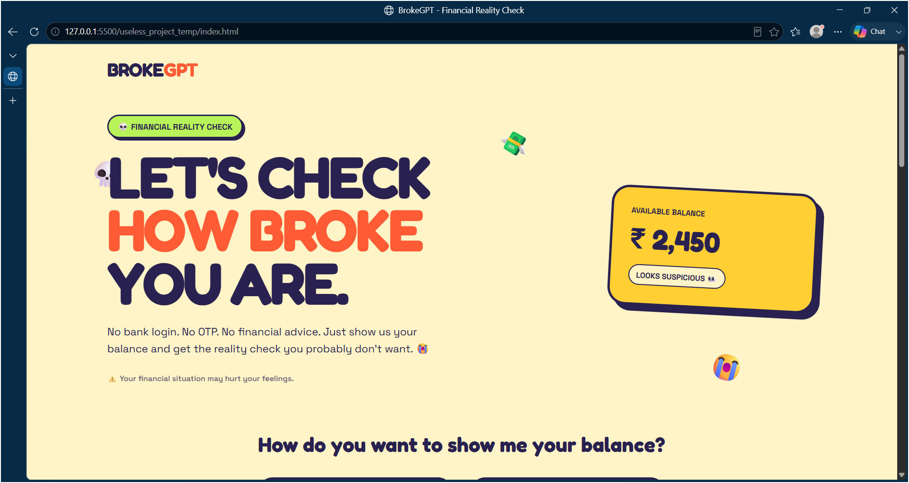
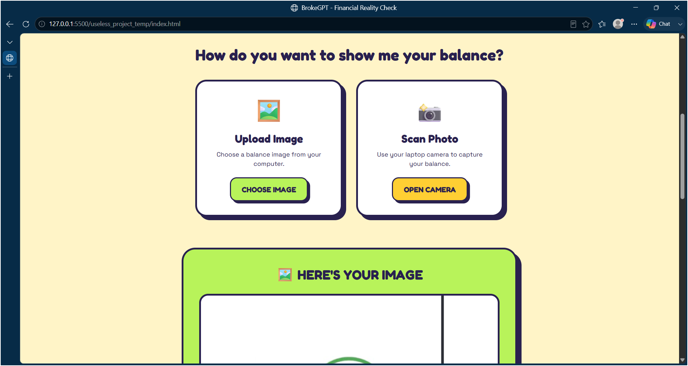
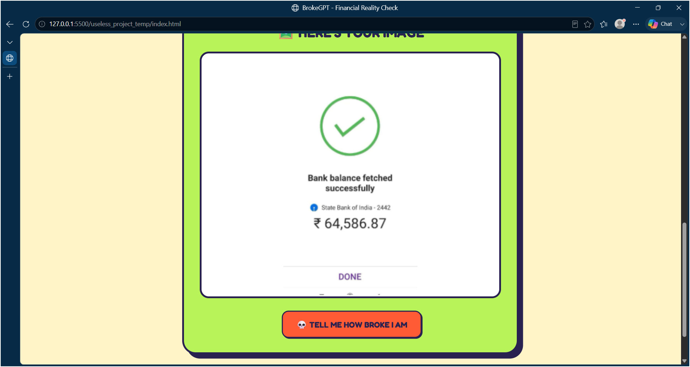
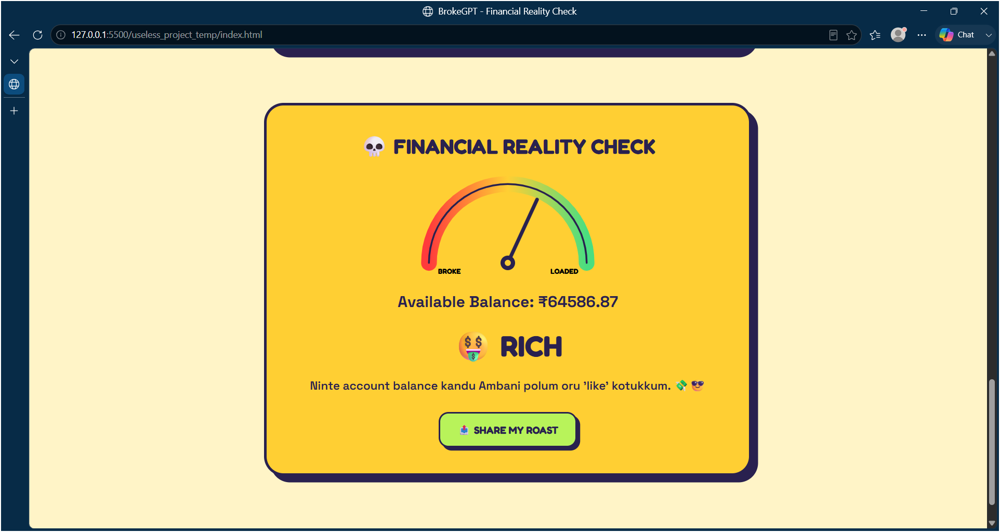
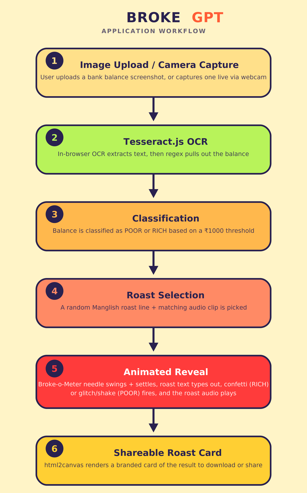

# BrokeGPT  🎯

## Basic Details
### Team Name: Stack Overlords

### Team Members
- Member 1:S Hashimi Ryhaan - Lbs Institute Of Technology For Women's
- Member 2: Ranjana R S - Lbs Institute Of Technology For Women's

### Project Description
BrokeGPT scans a screenshot (or live camera capture) of your bank balance, reads the amount using OCR, and brutally roasts you in Manglish — complete with a swinging "Broke-o-Meter" needle, voice clips, confetti or glitch effects, and a shareable roast card you can flex (or hide) on social media

### The Problem (that doesn't exist)
Nobody asked whether their bank balance needed public commentary. Banking apps just show you the number and let you quietly cry in peace. We felt that was a massive missed opportunity.

### The Solution (that nobody asked for)
Upload or scan a screenshot of your account balance. Tesseract.js OCRs the number straight out of the image, our "financial analysis engine" classifies you as 💀 POOR or 🤑 RICH, and you get roasted with a random Manglish one-liner plus a matching voice clip — while a needle gauge dramatically swings to reveal your fate. Once the damage is done, generate a shareable roast card and let the world know exactly how broke you are.

## Technical Details
### Technologies/Components Used
For Software:
- Languages: HTML5, CSS3, JavaScript (vanilla, no framework)
- Libraries: Tesseract.js (OCR), canvas-confetti (confetti burst), html2canvas (shareable image card)
- Fonts: Google Fonts — Fredoka, Space Grotesk
- Tools: VS Code, Git, GitHub

### Implementation
For Software:
# Installation
No build step or dependencies to install — it's a static site. All libraries (Tesseract.js, canvas-confetti, html2canvas, Google Fonts) load from CDN, so you just need an internet connection and a browser.

git clone [your-repo-link]
cd [repo-folder]

# Run
Just open index.html in a browser — or serve it locally for camera access to work reliably:

# using Python's built-in server, from the project folder
python3 -m http.server 8000

Then visit http://localhost:8000 in your browser.

### Project Documentation
For Software:

# Screenshots (Add at least 3)

  

The landing page introduces BrokeGPT and lets the user choose how they want to expose their financial situation.

  

Users can either scan their balance using a camera or upload a screenshot.

  

After selecting an image, BrokeGPT uses OCR to identify the available balance.

  

The Broke-o-Meter dramatically reveals the user's financial status before delivering the final roast.

# Diagrams

### Project Demo
# Video

https://github.com/user-attachments/assets/aec4d4c0-a752-42ad-bc40-2bc17493da71

The demo demonstrates:

1.Opening BrokeGPT
2.Selecting camera/upload mode
3.Scanning or uploading a balance screenshot
4.OCR balance detection
5.Broke-o-Meter animation
6.Random Manglish roast
7.Voice/audio output
8.Confetti/glitch effects
9.Generating the shareable roast card

 💀 Sorry for the funny dialogues — we thought your bank balance alone wasn't demotivating enough.

# Additional Demos
[Add any extra demo materials/links]

## Team Contributions
- S Hashimi Ryhaan
🎨 UI/UX design
💻 Frontend development
🔍 OCR integration
🎲 Roast engine
📊 Broke-o-Meter
🧪 Testing and debugging

Ranjana R S
💻 Frontend development
🔊 Audio/voice integration
🎨 Visual effects
📸 Shareable roast card
🧪 Testing and debugging
---
Made with ❤️ at TinkerHub Useless Projects 

⚠️ Disclaimer

BrokeGPT is a fun and experimental useless project.

It is not:

❌ A banking application
❌ A financial advisor
❌ A financial planning tool
❌ A replacement for actual financial advice

If BrokeGPT says you're broke...

We're probably not qualified to argue with it. 💀

❤️ Built For

TinkerHub Useless Projects 3.0
🎯 Team Stack Overlords
💸 BrokeGPT

"Your Balance. Our Judgment."

